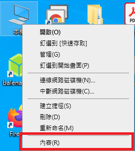
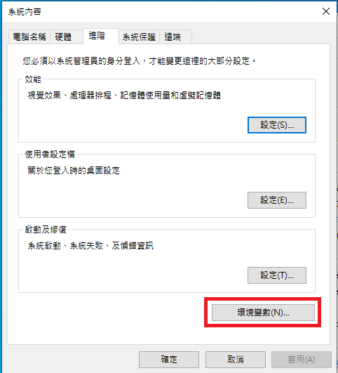
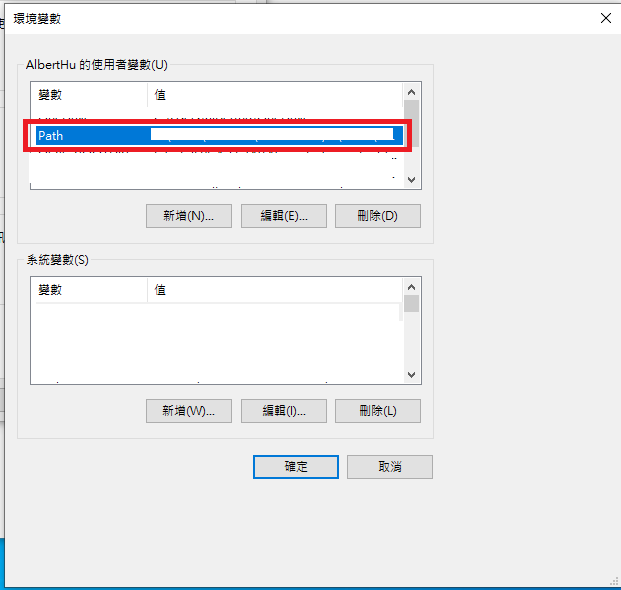
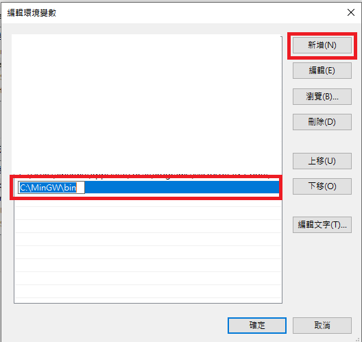

# 安裝相關軟體
- [VSCode](https://code.visualstudio.com)
- [MinGW](https://osdn.net/projects/mingw/releases/) for Windows
- GCC for Linux

# 在 Windows 10 上設定 MinGW 的環境變數

1. 在[本機]按右鍵，選擇[內容]

2. 在左邊欄位選擇[進階系統設定]

3. 選擇[環境變數]

4. 點選[Path]欄位，並按[編輯]

5. 點選[新增]，然後輸入MinGW的安裝位置。

