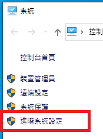

# 安裝相關軟體
- [VSCode](https://code.visualstudio.com)
- [MinGW](https://osdn.net/projects/mingw/releases/) for Windows
- GCC for Linux

# 在 Windows 10 上設定 MinGW 的環境變數

1. 在[本機]按右鍵，選擇[內容]


2. 在左邊欄位選擇[進階系統設定]



3. 選擇[環境變數]


4. 點選[Path]欄位，並按[編輯]


5. 點選[新增]，然後輸入MinGW的安裝位置。


6. 在[命令提示字元]上測試MinGW

在[開始]功能表圖示旁的搜尋輸入[cmd]，然後選擇[命令提示字元]。


7. 輸入下列指令

```
gcc --version
```


# 在 Windows 10 設定 VSCode

1. 下載並解壓縮[coding-env-setup](https://github.com/Albert-Hu/coding-env-setup/archive/main.zip)

2. 開啟 VSCode後，選擇[Open Folder]，並選擇解壓縮後的[coding-env-setup]資料夾


3. 選擇[Terminal]/[New Terminal]，下方即會增加[TERMINAL]的工作區域


4. 確認預設[Terminal]為[cmd]


5. 如果預設[Terminal]不是[cmd]的設，選擇[Select Default Shell]重設[Terminal]


6. 點選[Select Default Shell]之後，會在視窗上方出現選項，選擇[Command Prompt C:\Windows\System32\cmd.exe]


7. 重新開啟VSCode

8. 將[Terminal]當前的目錄位置移至[c_cpp]/[template]

```
cd c_cpp\template
```


點選[這裡](https://github.com/Albert-Hu/coding-env-setup/tree/main/c_cpp/template)到另一個教學。
